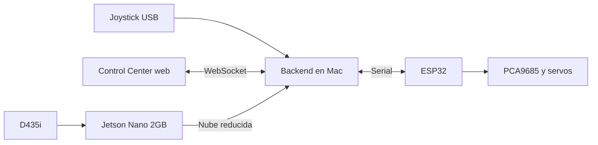

# Brazo Robot · Control Center y Percepcion 3D

Plataforma para controlar un brazo robot de seis grados de libertad con ESP32,
PCA9685 y servos MG995/SG90. Incluye control manual por joystick, firmware con
movimiento suavizado, gemelo digital en Three.js y una arquitectura preparada
para una Intel RealSense D435i.

## Estado actual

- Control de seis servos por ESP32 + PCA9685.
- Home y limites mecanicos por articulacion.
- Coreografias `saludo` y `rutina`.
- Backend Python tolerante a la ausencia de ESP32 o joystick.
- Deteccion automatica del puerto serial o configuracion explicita.
- Modo de simulacion con las coreografias completas.
- Control Center responsivo con reconexion WebSocket.
- Visualizacion 3D suavizada del brazo, campo visual y nubes de puntos.
- Percepcion simulada, RealSense local o RealSense remota desde Jetson Nano.
- Pruebas unitarias del control, limites y reactivacion manual.

## Arquitectura



La interfaz web no procesa video ni profundidad. Python produce un estado
compacto y Three.js se limita a renderizarlo. Esto permite trasladar la
percepcion de la Mac a una Jetson o a otro equipo Linux sin rehacer la UI.

## Estructura

```text
Brazo-robot/
├── README.md
├── docs/
│   ├── 01-hardware-y-conexiones.md
│   ├── 02-firmware-esp32.md
│   ├── 03-control-center.md
│   └── 04-realsense-jetson.md
├── robot_arm_controller/
│   └── robot_arm_controller.ino
└── control-center/
    ├── backend/
    │   ├── controller.py
    │   ├── joystick_manager.py
    │   ├── perception.py
    │   ├── jetson_perception_node.py
    │   ├── serial_manager.py
    │   ├── robot_state.py
    │   ├── ws_server.py
    │   └── tests/
    └── frontend/
        └── src/
```

El controlador standalone antiguo fue retirado para evitar dos mapeos de
joystick diferentes. El punto de entrada unico es `control-center/backend/main.py`.

## Inicio rapido sin hardware

Requisitos recomendados:

- Python 3.12 o 3.13.
- Node.js 20.19 o superior.

Backend:

```bash
cd control-center/backend
python3 -m venv .venv
source .venv/bin/activate
python -m pip install -r requirements.txt
python main.py --mode simulation --perception simulated --no-joystick
```

Frontend, en otra terminal:

```bash
cd control-center/frontend
npm ci
npm run dev
```

Abrir la direccion mostrada por Vite, normalmente `http://localhost:5173`.

## Ejecucion con el brazo

```bash
cd control-center/backend
source .venv/bin/activate
python main.py --mode hardware --perception off
```

El backend intenta encontrar el ESP32. Para indicar un puerto concreto:

```bash
python main.py --mode hardware --serial-port /dev/cu.usbserial-10
```

## RealSense y Jetson

La integracion se activa por etapas:

1. `simulated`: valida UI y nube 3D sin camara.
2. `realsense`: conecta la D435i al mismo equipo que ejecuta el backend.
3. `remote`: la Jetson captura y la Mac recibe una nube reducida.

Consulta [docs/04-realsense-jetson.md](docs/04-realsense-jetson.md) antes de
activar la camara. Los puntos de una D435i sin calibracion extrinseca **no se
deben usar para movimiento autonomo**.

## Seguridad

- `Cancelar / Home` detiene una coreografia y mueve el brazo a Home. No es un
  paro de emergencia.
- La telemetria angular es estimada: los servos actuales no proporcionan
  posicion medida.
- La percepcion no controla servos. Publica datos para una futura capa de
  planeacion con limites y autorizacion independientes.
- Se recomienda instalar un corte fisico de potencia para los servos antes de
  trabajar en autonomia.

## Verificacion

```bash
cd control-center/backend
python -m unittest discover -s tests -v

cd ../frontend
npm run lint
npm run build
```

## Documentacion

- [Hardware y conexiones](docs/01-hardware-y-conexiones.md)
- [Firmware ESP32](docs/02-firmware-esp32.md)
- [Control Center](docs/03-control-center.md)
- [RealSense D435i y Jetson Nano](docs/04-realsense-jetson.md)
