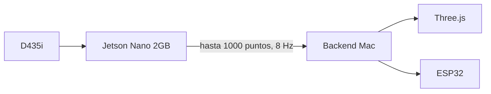

# Intel RealSense D435i + Jetson Nano 2GB

## Decision de arquitectura

Se conserva el Control Center web y se separa la percepcion:



Three.js no limita la vision del robot: WebGL puede dibujar nubes de puntos con
buffers en GPU. El cuello de botella real es capturar, filtrar y transportar
RGB-D. La Jetson realiza ese trabajo y evita enviar video crudo a la Mac.

Open3D es util para calibracion, inspeccion y reconstruccion offline. No se usa
como interfaz principal porque duplicaria la visualizacion y acoplaria el
control a una ventana nativa.

## Capacidades relevantes de la D435i

- Profundidad estereo con obturador global y campo amplio.
- Hasta 1280 × 720 de profundidad y hasta 90 fps, segun el perfil.
- RGB hasta 1920 × 1080 a 30 fps.
- IMU integrada.
- Rango ideal aproximado de 0.3 a 3 m.

Para este brazo se inicia conservadoramente con profundidad 640 × 480 a 30 fps,
nube reducida a 1000 puntos y publicacion a 8 Hz. RGB e IMU permanecen apagados
en esta primera fase para reducir ancho de banda y memoria; se activan de forma
explicita cuando exista un consumidor para esos datos.

## Restriccion de la Jetson Nano 2GB

La Jetson Nano 2GB llego a fin de vida como kit y permanece en JetPack 4.x. Las
versiones actuales de librealsense priorizan JetPack 5 o superior. Por eso:

1. No actualizar librealsense a ciegas.
2. Verificar primero la version exacta de JetPack/L4T instalada.
3. Compilar una version compatible de librealsense y `pyrealsense2` para el
   Python del sistema.
4. Ejecutar el nodo sin escritorio y con swap configurada si la compilacion lo
   requiere.
5. No instalar Open3D, navegador ni modelos grandes en la primera prueba.

La Nano es suficiente como capturadora y filtro ligero. La inferencia futura
debe usar modelos pequeños optimizados con TensorRT o trasladarse a hardware
mas reciente si el consumo de RAM supera el margen disponible.

## Nodo Jetson

Una vez que `pyrealsense2` funcione en la Jetson:

```bash
cd control-center/backend
python jetson_perception_node.py \
  --serial 926522071007 \
  --host 0.0.0.0 \
  --port 8766 \
  --max-points 1000 \
  --rate 8
```

En la Mac:

```bash
python main.py \
  --mode hardware \
  --perception remote \
  --perception-url ws://IP_DE_LA_JETSON:8766
```

El puerto 8766 no tiene autenticacion ni cifrado. Debe exponerse solamente en
una red local confiable; este nodo publica percepcion y deliberadamente no
acepta comandos de movimiento.

## Calibracion obligatoria

La nube cruda usa el marco optico de la camara. Antes de detectar colisiones o
planear trayectorias se necesita una matriz extrinseca que transforme puntos al
marco `robot_base`.

El Control Center muestra `calibracion: pendiente` mientras esa transformacion
no exista. Es intencional: una nube bonita pero mal alineada es peligrosa.

## Fases siguientes

1. Verificar USB 3, profundidad y numero de serie.
2. Medir pose de montaje de la camara.
3. Calibrar camara respecto a la base.
4. Segmentar mesa, suelo y objetos.
5. Crear mapa de ocupacion y volumen prohibido.
6. Añadir planeador en simulacion.
7. Autorizar movimientos reales con limites y paro fisico.
